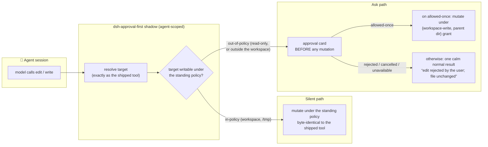

# dsh-approval-first

A [DeepSeek Harness](https://github.com/deepseek-ai/deepseek-harness) (DSH)
plugin: install it into a profile alongside your own plugins.

> [!WARNING]
> **Interim shim — expect deprecation.** This plugin works by *shadowing*
> the harness's shipped `edit` and `write` tools with frozen copies that
> insert an approval step. When the DSH platform grows native one-turn
> escalation, this bundle becomes obsolete and should be removed — that is
> its documented exit. Until then, every harness update can change the
> shipped tools underneath it, so the plugin carries a **drift tripwire**
> that refuses to boot when the copies no longer mirror the harness (see
> [Deprecation & drift](#deprecation--drift)).

**Approval-first file mutations.** Under a confining sandbox, an
out-of-policy `edit`/`write` today runs: tool call → red
`[sandbox: file access denied …]` error → the model re-sends the *identical*
call with `sandbox_permissions` + `justification` → approval prompt → write.
This plugin makes the **first** call ask first — and only where the standing
policy would deny the mutation anyway, so ordinary in-workspace writes keep
today's silent behavior.

One model turn, no error turn in the transcript, no tool arguments tokenized
twice, no model-authored prose as the review object.

## Architecture



The ask rule is uniform: **ask iff the resolved target is not writable under
the standing policy**, using the sandbox fence's own allow-list definition
(the session workspace plus `/tmp` and the platform temp dir under
`workspace-write`; nothing under `read-only`). The same algorithm the fence
enforces with is the one the plugin decides with, so the two cannot disagree
about what "inside" means — and on the rare alias/casing miss, a refused
silent attempt converts into the ask instead of an error.

## Plugin value proposition

| alternative | falls short |
|---|---|
| shipped deny-then-retry | a red error in the transcript, the full tool arguments tokenized twice, and the review object is model-authored prose rather than the diff |
| standing mode `danger-full-access` | no approval boundary at all — every write everywhere is silent |
| a wrapper that asks on every mutation | N prompts per session for ordinary in-workspace writes; users click through and stop reading cards |
| bash-style one-shot retry fields | the denial IS the trigger — the model must first eat an error to learn it should ask |

**Rejected is a result, not an error.** A user decision never throws: the
model sees one calm normal-text result (`edit rejected by the user; file
unchanged`) and can move on. Only real technical failures (stale version,
read-first policy) keep the shipped error texts and remedies.

## How to install

Requires a DeepSeek Harness checkout and a profile (here `web`):

```sh
# from the harness checkout
pnpm dsh plugin --profile web add /path/to/dsh-approval-first

# verify the profile still composes
pnpm dsh --profile web --dump-config
```

Then (re)start the harness; the host half loads at boot. Configure the row
in the profile's `cordis.patch.yml`:

```yaml
- id: approval-first
  config:
    activeModes: ['read-only', 'workspace-write']
```

## What happens when

| standing mode | in-policy target (workspace, /tmp) | out-of-policy target |
|---|---|---|
| `read-only` | — (nothing is writable) | **asks first** |
| `workspace-write` | **silent** — identical to the shipped tools | **asks first** |
| `danger-full-access` | silent (shadow is a passthrough) | silent |

Registration is **live**: each agent's shadows are armed/disarmed at
creation and on every mid-session mode switch (the durable `sandbox/mode`
event), so changing a session's policy takes effect on the very next call —
no restart, no new session.

Apart from the inserted gate, the shadows mirror the shipped tools exactly:
parameter and output schemas, validation and error texts, read-first policy
participation, `fs/observed` recording, diff cards, and success phrasing.
The model cannot detect the difference except by the absence of denials.

## Deprecation & drift

This plugin is a shim over a platform gap, and it will not age silently:

- **Likely deprecation.** The day DSH grows one-turn escalation as a
  first-class status, remove this bundle (`dsh plugin --profile web remove
  dsh-approval-first`). Nothing else needs cleanup — no files, no settings,
  no services.
- **Drift is loud, not silent.** Because the shadows are frozen copies, a
  harness update that changes the shipped `edit`/`write` would otherwise
  leave this plugin serving stale behavior with zero errors anywhere. The
  drift tripwire instead compares the copies against the live tool
  definitions at boot and refuses to activate on mismatch
  (`driftMode: 'warn'` downgrades that to a logged warning). Renames and
  removals upstream are caught too — the plugin never serves ghost tools.
- **The playbook lives in the repo**: [maintenance.md](maintenance.md) has
  the copied-from inventory (every frozen piece mapped to its upstream
  source file), the post-update ritual, and a symptom → cause → action
  table for drift failures.

Known scope: `edit` and `write` only — bash keeps the classic escalation
path. If another plugin already shadows `edit`/`write` for an agent, that
agent is skipped (the existing winner stands).

## Testing

Plain Node scripts, no build step, faithful fake context (enforces the
Cordis inject guard so the suite can actually fail):

```sh
node test/plugin.test.mjs        # 65 checks: gating, outcome branches, per-call policy,
                                 # workspace-write ask/silent matrix, drift tripwire,
                                 # live mode-switch arm/disarm, reversibility
node test/diff-parity.test.mjs   # 31 cases at parity with the shipped diff algorithm
                                 # (oracles against the harness's own `diff` package)
```

## Maintenance

After every harness update, run the ritual in
[maintenance.md](maintenance.md): both suites, watch the boot row (a failed
`approval-first` row is the tripwire doing its job), one manual smoke of
each column in the behavior table.
